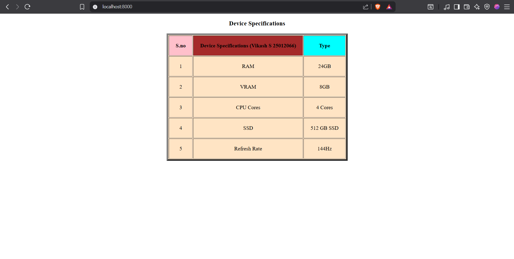
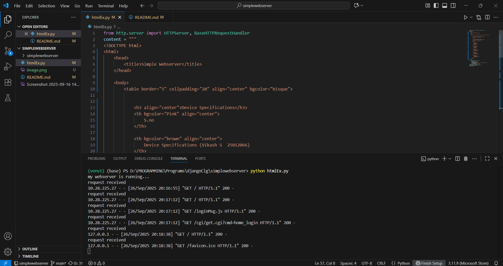

# EX01 Developing a Simple Webserver
## Date:16.9.2025

## AIM:
To develop a simple webserver to serve html pages and display the Device Specifications of your Laptop.

## DESIGN STEPS:
### Step 1: 
HTML content creation.

### Step 2:
Design of webserver workflow.

### Step 3:
Implementation using Python code.

### Step 4:
Import the necessary modules.

### Step 5:
Define a custom request handler.

### Step 6:
Start an HTTP server on a specific port.

### Step 7:
Run the Python script to serve web pages.

### Step 8:
Serve the HTML pages.

### Step 9:
Start the server script and check for errors.

### Step 10:
Open a browser and navigate to http://127.0.0.1:8000 (or the assigned port).

## PROGRAM:
```
from http.server import HTTPServer, BaseHTTPRequestHandler
content = """
<!DOCTYPE html>
<html>
    <head>
        <title>Simple Webserver</title>
    </head>

    <body>
        <table border="5" cellpadding="20" align="center" bgcolor="bisque">
            

            <h3 align="center">Device Specifications</h3>
            <th bgcolor="Pink" align="center">
                S.no
            </th>
            
            <th bgcolor="brown" align="center">
                Device Specifications (Vikash S  25012066)
            </th>
            <th bgcolor="cyan" align="center">
                Type
            </th>
            
            <tr align="center">
                <td>1</td>
                <td>RAM</td>
                <td>24GB</td>
            </tr>

            <tr align="center">
                <td>2</td>
                <td>VRAM</td>
                <td>8GB</td>
            </tr>

            <tr align="center">
                <td>3</td>
                <td>CPU Cores</td>
                <td>4 Cores</td>
            </tr>

            <tr align="center">
                <td>4</td>
                <td>SSD</td>
                <td>512 GB SSD</td>
            </tr>
            
            <tr align="center">
                <td>5</td>
                <td>Refresh Rate</td>
                <td>144Hz</td>
            </tr>
                    
        </table>
    </body>
</html>
"""
class myhandler(BaseHTTPRequestHandler):
    def do_GET(self):
        print("request received")
        self.send_response(200)
        self.send_header('content-type', 'text/html; charset=utf-8')
        self.end_headers()
        self.wfile.write(content.encode())
server_address = ('',8000)
httpd = HTTPServer(server_address,myhandler)
print("my webserver is running...")
httpd.serve_forever()
```


## OUTPUT:



## RESULT:
The program for implementing simple webserver is executed successfully.
